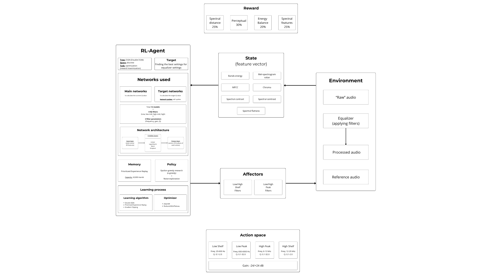
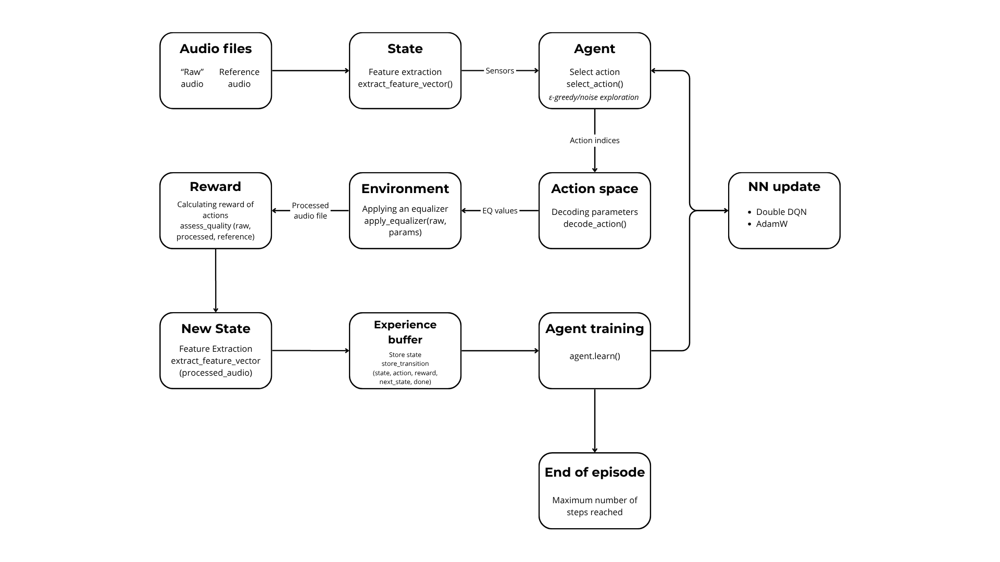
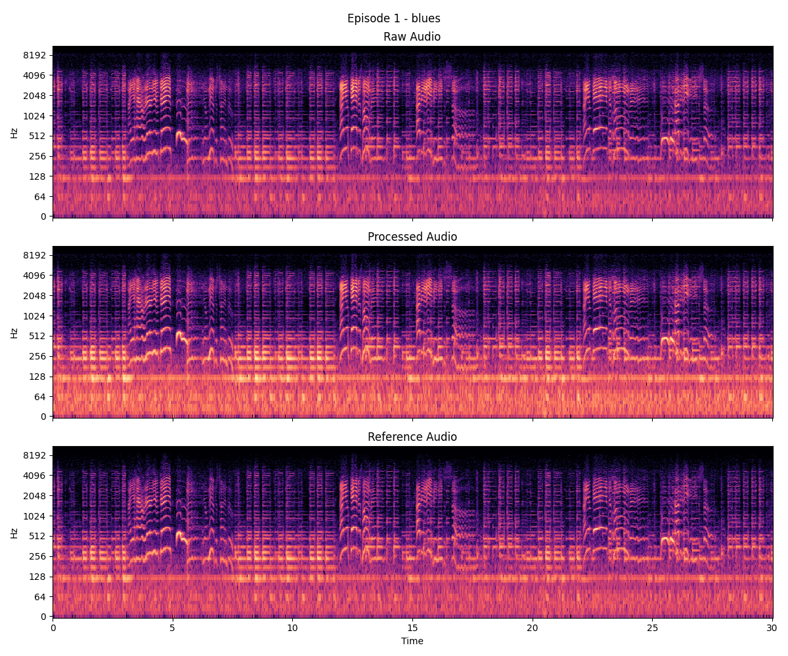
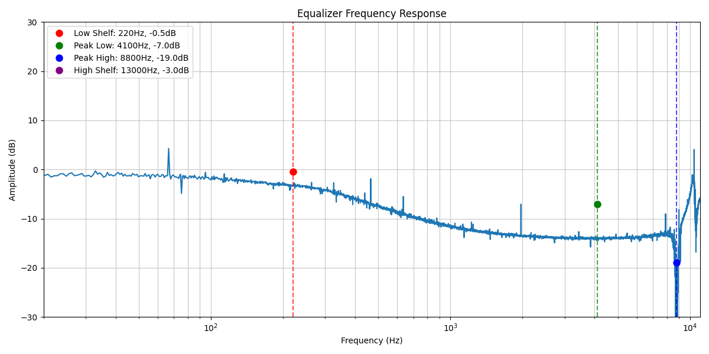
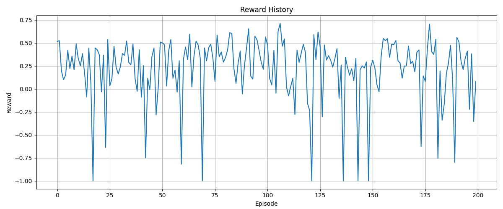
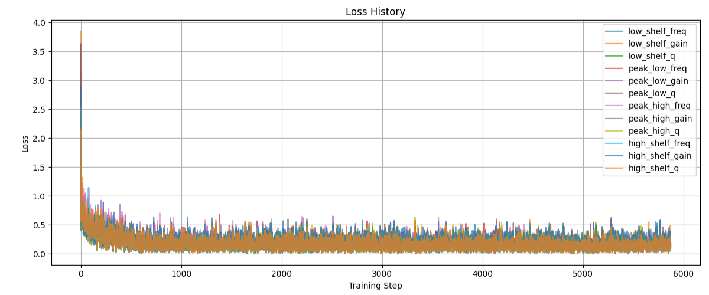
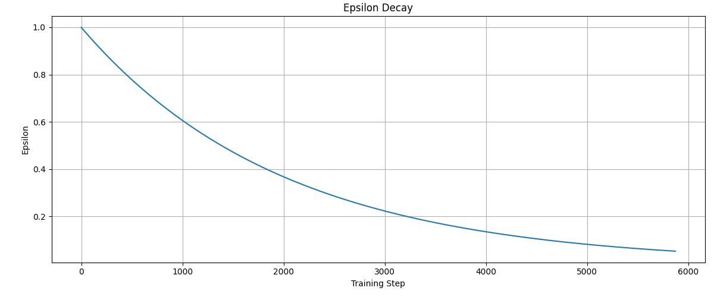
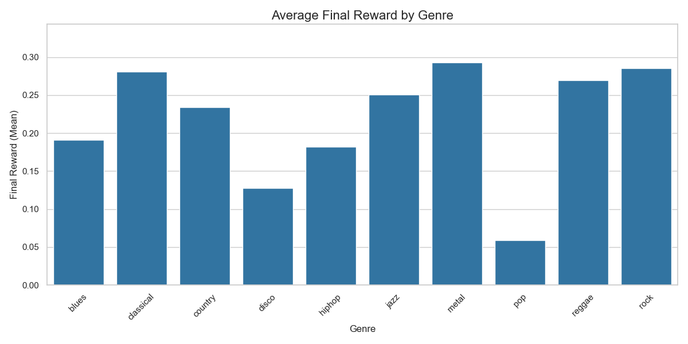

# 🎛️ RL-Agent Audio Equalizer

This project aims to create an intelligent agent that uses reinforcement learning methods to automatically adjust the equaliser for audio processing. The agent learns to improve distorted recordings, bringing them closer to the reference sound, which allows you to create a synthetic dataset with features and corresponding parameters for further training of models in teacher mode.

## 📋 Overview

This project implements an intelligent agent based on the **Deep Q-Learning** algorithm with a **Double DQN** modification for automatic adjustment of equaliser parameters (frequency, gain, Q-factor) to improve audio quality.

**Key features:**
- 🎧 **Audio analysis** based on spectral-acoustic features
- 🎚️ **Automatic tuning** of a 4-band equaliser to bring the raw sound closer to the reference example
- 📈 **Evaluation of processing quality** and approximation to the reference using a set of metrics: spectral distance, energy balance, perceptual similarity
- 🗃️ **Generation of a synthetic dataset** for further use in supervised learning

## 🚀 Implementation

### 🔧 Main components:

- **Algorithm:** Deep Q-Network (DQN) with improvements:
    - Double DQN
    - Prioritised Experience Replay
    - Soft Target Network Updates
- **Environment:** Pair `raw audio ↔ reference audio`, generated based on the GTZAN dataset.
- **Audio features:** 
    - MFCC
    - Chroma
    - Mel-spectrogram-values
    - Spectral centroid 
    - Spectral flatness 
    - Spectral contrast
    - Energy characteristics
- **Action space:** Discrete parameters of four equaliser filters.
- **Reward:** Combined function of 5 similarity metrics and audio improvement.
- **Experience buffer:** `PrioritizedReplayBuffer` with importance compensation.

---
#### 📊 [RL-Agent component diagram](https://www.canva.com/design/DAGu23T1KlA/-7RK4ZtioLauQDxSfGLJkg/edit?utm_content=DAGu23T1KlA&utm_campaign=designshare&utm_medium=link2&utm_source=sharebutton)



---
### 🛠️ Technologies used

- **Python 3.11**
- **PyTorch:** used to create and train the DQN agent
- **Audio processing:** 
  - **Librosa:** for audio analysis, calculating spectral characteristics
  - **SoundFile:** for saving processed audio files
- **NumPy:** numerical calculations
- **Matplotlib:** creating graphs, spectrograms
- **Logging:** keeping logs
- **os, datetime:** file operations
- **SciPy:** implementation of equaliser filters and mathematics

## 📐 Pipeline system

### Input data and preparation

1. **GTZAN dataset**  
    Used as a source of reference audio tracks (10 genres × 100 files).

2. **Generation of raw versions ([distortion-audio](scripts/distortion_audio.py))**  
    Equaliser filters with randomly generated parameters and additional ‘air’ are applied to each reference track, allowing for an unlimited number of unique `‘raw ↔ reference’` pairs.  
3. **Feature extraction:**
   - **Energy features**
   - **Spectral-acoustic** 
   - **Spectral**  

    For each feature, statistics are taken from the raw and reference files and their difference → **forms a state vector**.  
4. **Formation of episodes**
    - Each episode: random selection of a pair `raw ↔ reference`.
    - Amplitude normalisation and length alignment.
    - Initialisation of the initial state (feature vector).

---
### Agent training

- **Algorithm:** DQN + Double DQN
- **Exploration policy:** ε-greedy with noise
- **Reward function**:
    $$
    R(s, a) = \min\left( \max\left(
    0.25 \cdot \Delta_{spectral} +
    0.30 \cdot \Delta_{perceptual} +
    0.20 \cdot \Delta_{balance} +
    0.15 \cdot \Delta_{centroid} +
    0.10 \cdot \Delta_{flatness} - 1, \, 0 \right), \, 1 \right)
    $$
    where $R(s, a)$ is the agent's reward for action $a$ in state $s$;  
    $∆$ is improvement value of the metric.

---
#### [Agent training episode diagram](https://www.canva.com/design/DAGu3G_xvI8/APojeV2-VUmIeeke3-_tkw/edit?utm_content=DAGu3G_xvI8&utm_campaign=designshare&utm_medium=link2&utm_source=sharebutton)



---
### 🎧 Examples of work

#### 🎛️ Spectrograms

_Example of spectrograms of raw, processed and reference tracks_



---
#### 📈 EQ curves

_Equaliser frequency response graph with optimised filter parameters_



---
#### 🔊 Audio demo

Three audio clips from a single training episode:

- [Raw audio](assets/audio/raw_audio.wav) – original, unprocessed signal  
- [Processed](assets/audio/processed_audio.wav) – the result of the agent's action after selecting EQ parameters
- [Reference](assets/audio/ref_audio.wav) – the target example that the agent strives for 

---
### 📊 Results

#### Agent reward graph

The graph shows a gradual increase in average rewards, indicating successful training.  
Declines are associated with genre differences in tracks when the agent's strategy is not generalised to new audio.



---
#### Loss graph

The graph shows the loss values of the neural network for predicting the Q-values of each of the equaliser parameters.



---
#### Epsilon schedule

Shows how ε gradually decreases during agent training to balance exploration and exploitation.



---
#### Award schedule by genre

Average award schedule by genre during training.



---
### 📦 Output data

- **Generated dataset**  
CSV with feature vectors and optimal EQ parameters for each track ([example dataset](assets/eq_prediction_dataset_ex.csv))
- **Trained agent models ([models](result/train_results/best_model/))**  
Saved trained DQN models for predicting Q-values for each of the 12 equaliser parameters

## 🛠️ Future improvements

- **Expanding audio data**  
Collecting additional open audio files with different sampling rates (e.g., 44,100 Hz) for better model generalisation.
- **Genre-specific models**  
Training separate agents for each genre to reduce instability and sharp drops in rewards.
- **Alternative architectures**  
Exploring more complex neural networks for better approximation of the Q-function.
- **Expanding the action space**  
Increasing the number of discrete states or transitioning to a continuous action space (requires more computational resources).

## 📁 Project structure

```
rl-agent-audio-equalizer/
├── assets/                  # Project assets (figures, audio files, visualizations, etc.)
│   ├── audio/               # Example audio files 
│   ├── eq_processing/       # Equalizer-related visualizations
│   ├── figures/             # Diagrams and component illustrations
│   ├── plots/               # Training-related plots
├── data/                    # Audio files for training and testing (raw and reference)
│   ├── GTZAN/               # GTZAN dataset (10 genres × 100 files)
├── logs/                    # Logs generated during training and evaluation
├── result/                  # Trained models, evaluation results, and generated plots
│   ├── train_results/       # Results and models from training
│   ├── test_results/        # Results from testing and evaluation
├── scripts/                 # Utility scripts for preprocessing and dataset generation
│   ├── audio_trimming.py    # Script for trimming audio files
│   ├── check_CUDA.py        # Script to check CUDA availability
│   ├── distortion_audio.py  # Script for generating distorted audio samples
├── src/                     # Main source code for the project
│   ├── agent/               # Implementation of the RL agent and its components
│   ├── core/                # Core functionality (e.g., audio equalizer, quality evaluation)
│   ├── training/            # Training scripts and logic for the RL agent
│   ├── utils/               # Helper functions
├── README.md                # Documentation and project overview
├── requirements.txt         # Python dependencies for the project
├── main.py                  # Entry point for running the project
├── LICENSE                  # Project license
├── NOTICE                   # Copyright and license notice
└── .gitignore               # Files and directories to ignore in version control   
```

## 🚀 How to run

1. Clone the repository:

```bash
git clone https://github.com/LarLex001/rl-agent-audio-equalizer.git
```

2. Install dependencies:

```bash
pip install -r requirements.txt
```

3. Run the main file:

```bash
python main.py
```

## 📝 License

This project is licensed under the Apache License 2.0.
You are free to use, modify, and distribute this software under the terms of the license.

- See the full license text in [LICENSE](LICENSE).
- Attribution and additional copyright information are provided in [NOTICE](NOTICE).
